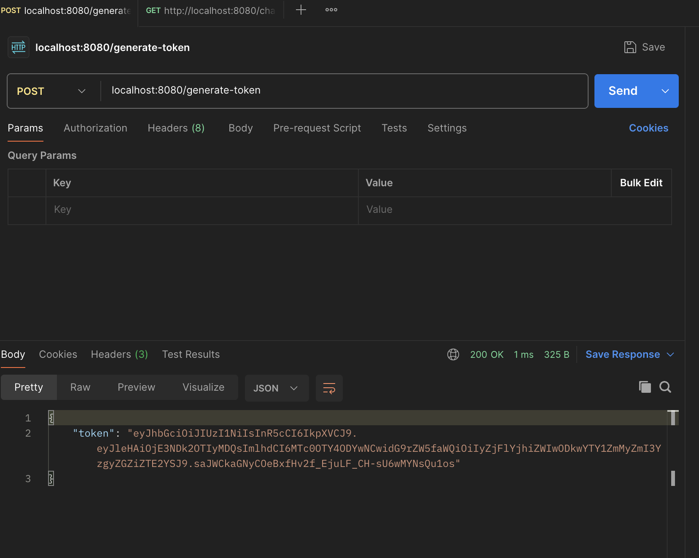
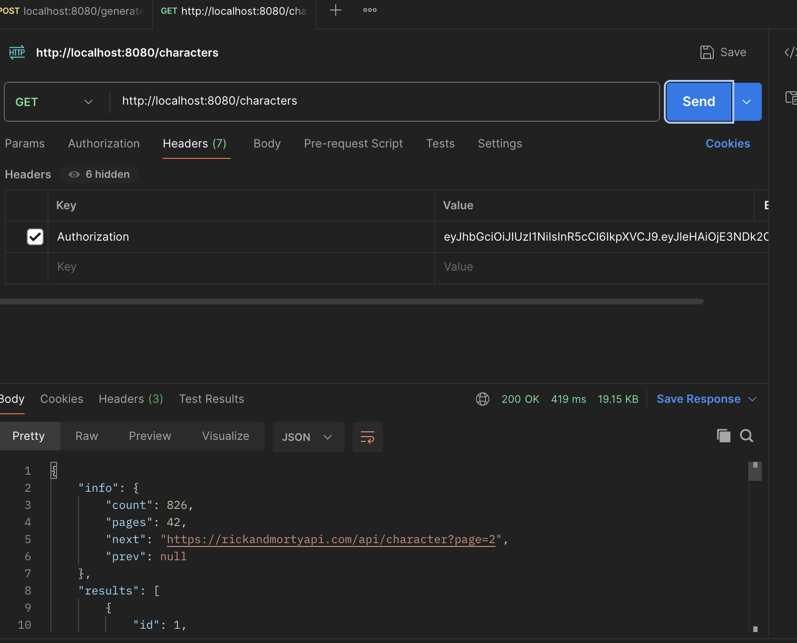
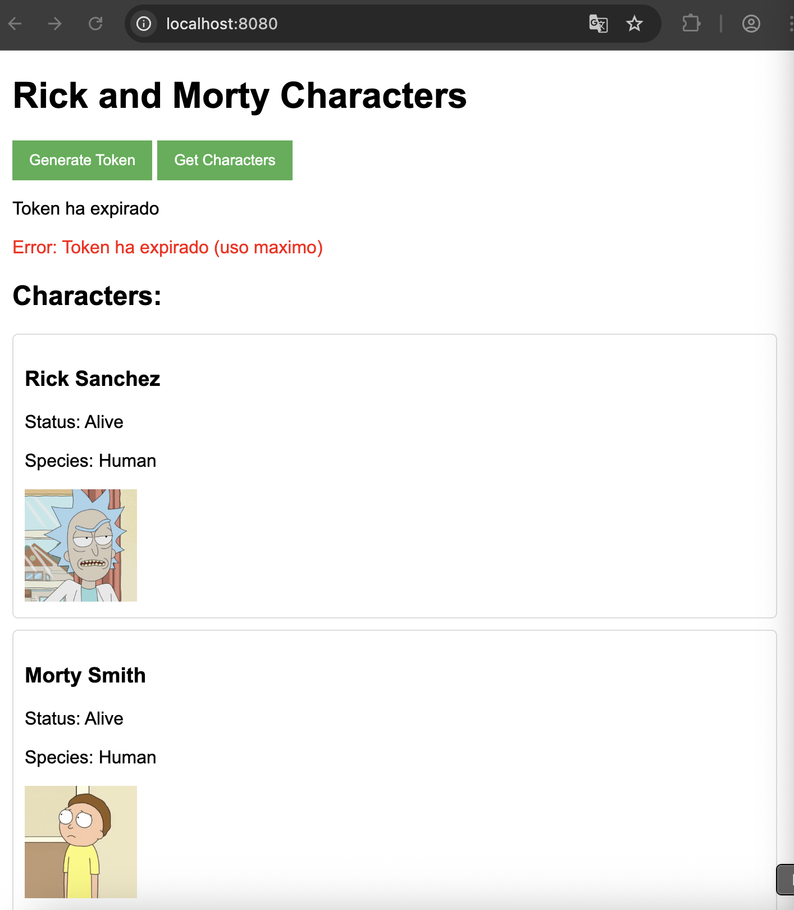

# Prueba Pulzo

El repositorio cuenta con la prueba solicitada del servicio para el cargo de desarrollador backend en Pulzo.com 

# Software utilizado 

## Golang

La prueba se realizo en **GoLang** en su version 1.21.13 con las siguientes librerias 

__Gin Gonic:__ framework utilizado para montar el servidor web y manejo de rutas, por su facilidad de uso 

__jwt:__ Libreria para la creacion y gestion de tokens en la aplicacion 

## Docker 

Para la dockerizacion de la aplicacion
# Estructura del proyecto
```md
Prueba Pulzo
├── auth-service
│   ├── templates
│   |   ├── index.html
│   ├── Dockerfile
│   ├── go.mod
│   ├── handlers.go
│   ├── jwt.go
│   ├── main.go
│   ├── middleware.go
├── data-service
│   ├── go.mod
│   ├── main.go
├── README.md
└── docker-compose.yml
```
# Funcionalidades
- Generación de tokens JWT con límite de 5 usos
- Validación de tokens
- Interfaz web para pruebas

# Funcionamiento 

## Endpoints

### Auth Service
- `POST /generate-token` → Genera nuevo token
- `GET /characters` → Obtiene personajes (requiere token)

### Data Service
- `GET /api/characters` → Proxy a la API pública

1. Clona el repositorio 

```md
    git clone https://github.com/davidpardo015/prueba_pulzo
```
2. Construye la imagen 

```md
    docker-compose build 
```
3. Sube la imagen 
```md
    docker-compose up
```
4. En postman probar los endpoints

* El endpoint localhost:8080/generate-token se genera el token aleatorio con una peticion **POST**



* El endpoint http://localhost:8080/characters en el header creamos Authorization y el valor sera el token dado en el anterior punto, se realiza con una peticion **GET**



* Una vez la consulta se realice 5 veces con el mismo token devolvera un mensaje de "Token ha expirado (uso maximo)"


**Adicional**

Se podra evidenciar una visualizacion basica en el endpoint http://localhost:8080/ se mostraran dos botones uno para generar el token y otra para realizar la consulta.



### 📇 Conoce un poco mas de mi en LinkedIn


Siempre estoy abierto al networking y a oportunidades profesionales. 

[](https://www.linkedin.com/in/nicolas-david-pardo-betancourth/)

